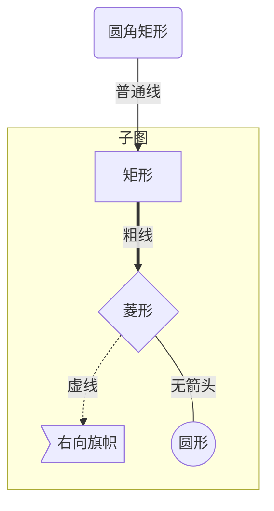
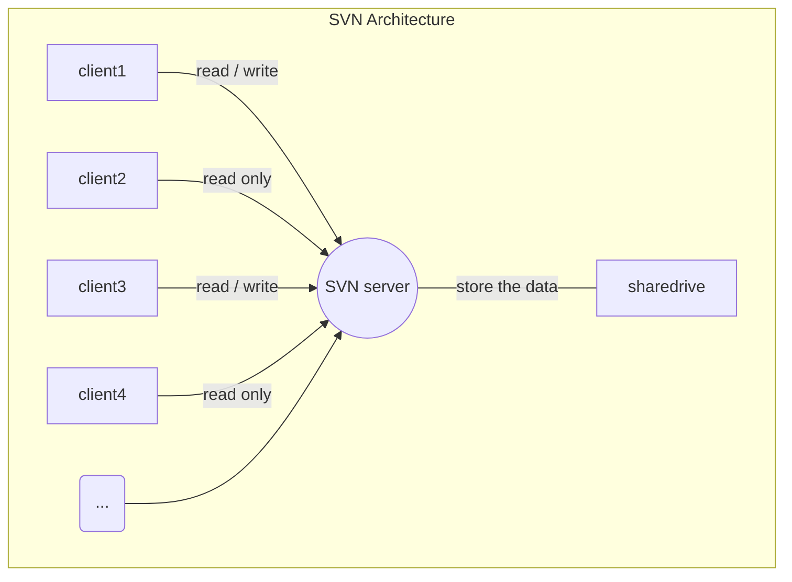
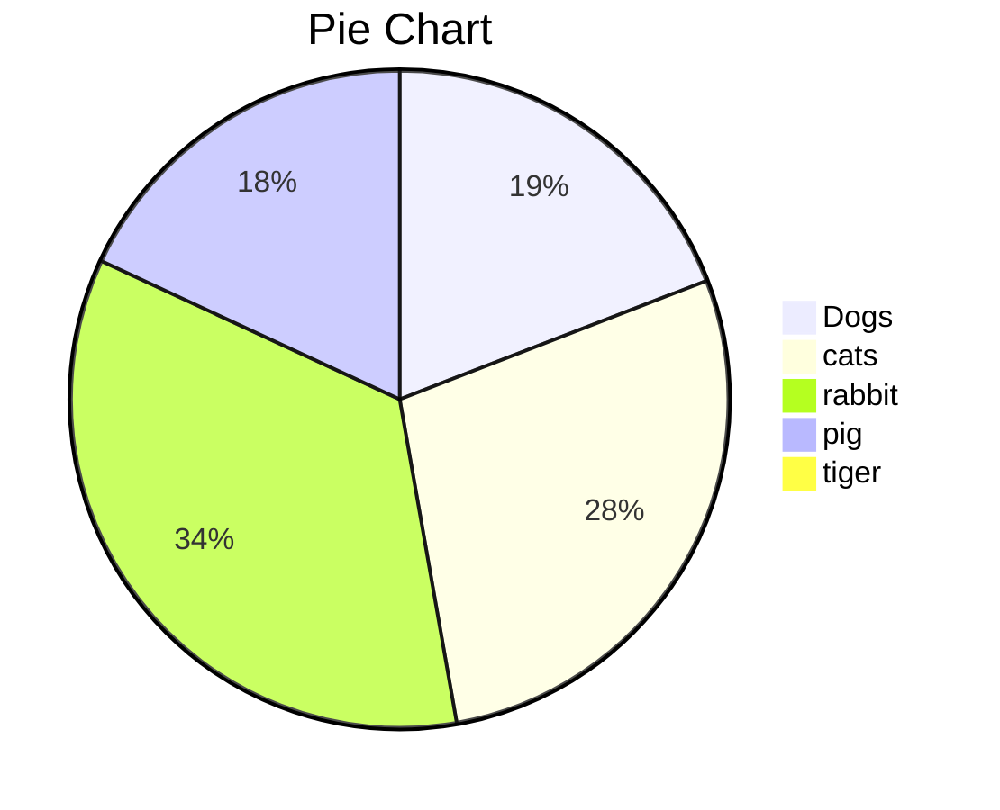
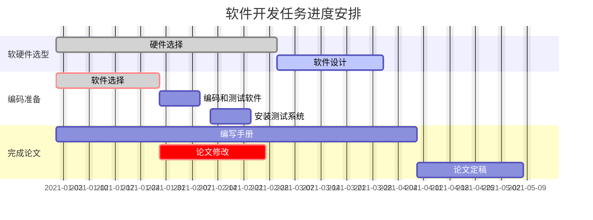

Markdown 制图
------------------------

| 字母表示 | 含义                   |
| -------- | ---------------------- |
| TB       | 从上到下 Top -> Bottom |
| BT       | 从下到上               |
| LR       | 从左到右 Left -> Right |
| RL       | 从右到左               |

| 表述       | 说明         | 含义                                               |
| ---------- | ------------ | -------------------------------------------------- |
| id[文字]   | 矩形节点     | 表示过程                                           |
| id(文字)   | 圆角矩形节点 | 表示开始与结束                                     |
| id((文字)) | 圆形节点     | 表示连接。为避免流程过长或有交叉，可将流程切开成对 |
| id{文字}   | 菱形节点     | 表示判断、决策                                     |
| id>文字 ]  | 右向旗帜节点 |                                                    |

| 消息线类型 | 含义                     |
| ---- | -------------------------- |
| ->   | 无箭头的实线               |
| -->  | 无箭头的虚线               |
| ->>  | 有箭头的实线(主动发出消息) |
| -->> | 有箭头的虚线(响应) |
| -x | 末端为X的实线(主动发出异步消息) |
| --x | 有箭头的实线(以异步形式响应消息) |

### 示例

#### 流程图

#### 架构图

#### 饼图

#### 甘特图
